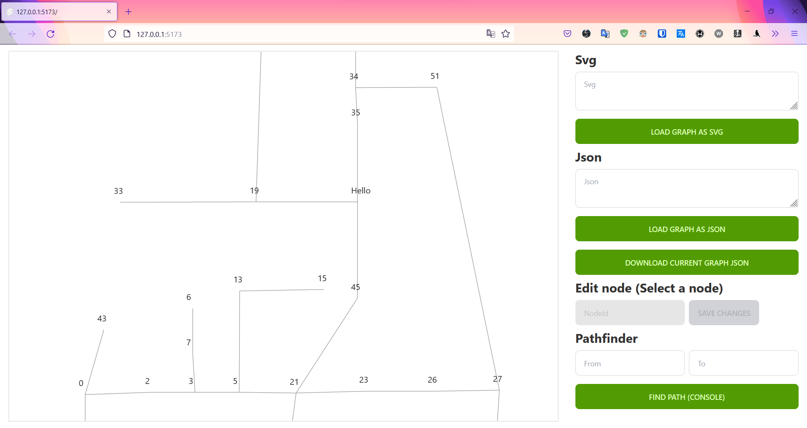

# SvgToGraphConverter


Features:
- Convert svg paths to graph
- Visualize created graph
- Edit id's of created graph
- Download graph as json
- Load graph as json

Created with Svelte and ngraph

# Usage
```powershell
git clone https://github.com/Daellhin/SvgToGraphConverter.git
npm i
npx vite dev
```
